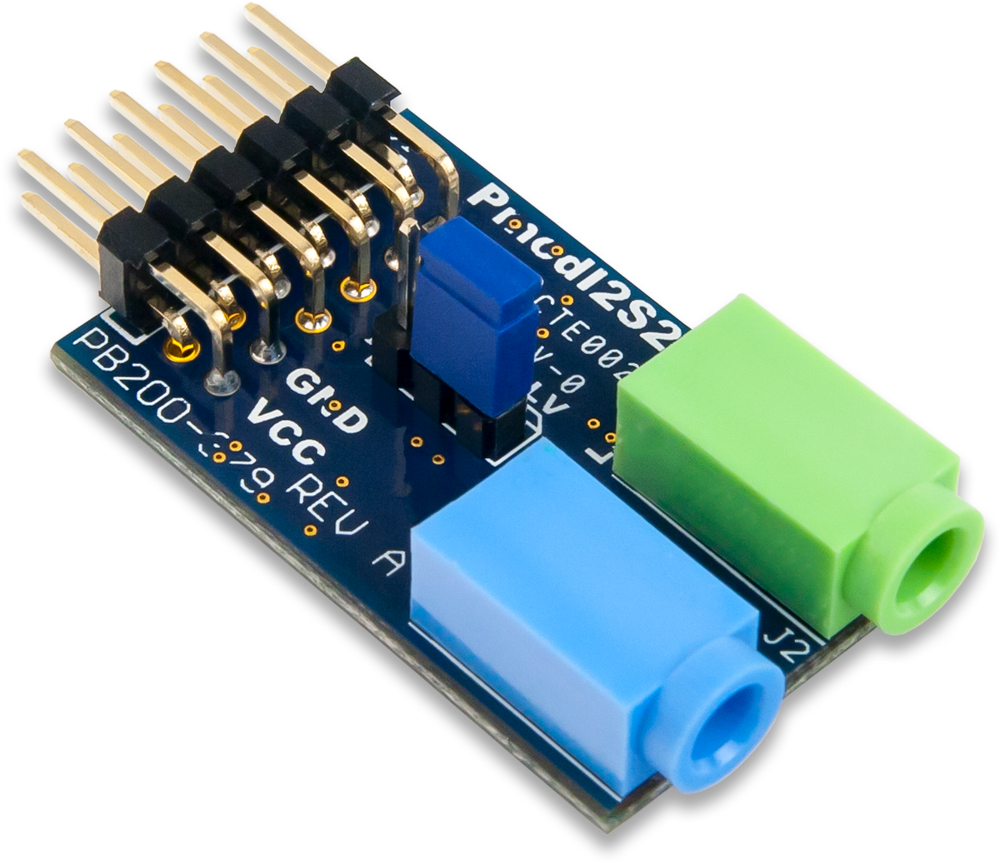
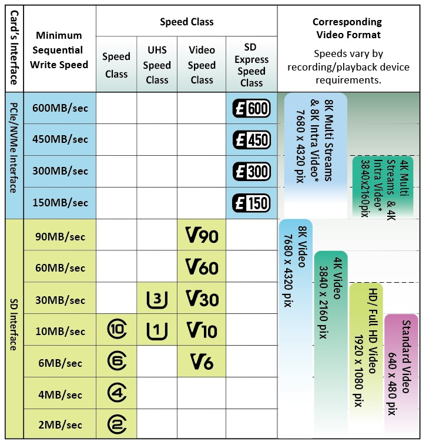

# 🚀 Audio Recorder with ESP32 S3 N16R8 and SD Card in 4-bit SDIO mode.

## 📜 *Description*
This project allows recording audio at 16 bits @ 44.1 kHz, storing the data as raw values in a *.bin* file (not as a standard audio file).
It uses a SD card in SDIO (4-bit) mode, ESP32 S3 N16R8, and an audio codec (PMOD I2S2).

## 🛠️ *Hardware Requirements*

### *ESP32 S3 N16R8*
- Microcontroller responsible for recording audio data and interfacing with the audio codec and SD card.  
- Equipped with enough serial peripherals to manage I2S in full duplex mode (audio loopback used for debugging), I2S Master Clock, and the SDIO.
- 8 MB of RAM allows power efficiency improvements (not implemented yet).

<div style="text-align: center;">
  
  <p><em>ESP32 S3</em></p>
</div>

### *PMOD I2S2 Audio Codec* *[Product link](https://digilent.com/reference/pmod/pmodi2s2/reference-manual)*
- Converts audio signals to I2S format.  
- Requires Master Clock.  
- This module includes both DAC and ADC functionalities, simplifying audio testing.

<div style="text-align: center;">
  
  <p><em>PMOD I2S2</em></p>
</div>

<div style="text-align: center;">
  
  <p><em>PMOD I2S2 Pinout</em></p>
</div>

### *SD card (SDIO compatible)*
- SD cards can work in SDIO 4-bit mode, increasing data transfer compared to SPI mode.
- SD cards can be connected directly to 3V3. A micro SD card adapter can be used for this mode.

<div style="text-align: center;">
  
  <p><em>SD Card pinout</em></p>
</div>

- Audio file size can be calculated with [Audio File Size Calculator](https://www.omnicalculator.com/other/audio-file-size).
- SD Card speeds are often indicated by logos printed on them:

<div style="text-align: center;">
  <a href="https://www.sdcard.org/consumers/about-sd-memory-card-choices/speed-class-standards-for-video-recording/">
    
  </a>
  <p><em>SD Speed Class</em></p>
</div>

# 💻 *Sketch*
- The sketch is developed using Arduino IDE, allowing comparison of different MCUs without the need to learn new IDEs for each platform.
- The I2S driver provided by Espressif Systems is unique and not compatible with other platforms.

## *Arduino IDE setup.*
-  PSRAM enabled: OPI PSRAM.
-  Avoid using GPIO 35, 36 and 37 if OPI PSRAM is enabled.
- CPU frequency can be as low as 80 MHz. 
- At 40 MHz wifi won't connect. I2S will halt the system.
- 'USB CDC on Boot Enabled' and 'Core Debug Level Error' allows Serial.print to work properly.

<div style="text-align: center;">
  
  <p><em>Arduino IDE configuration</em></p>
</div>


## *SD Card*
### *SD/MMC 4 BIT BUS:*
```c
  #define BLOCK_SD 1024*3
```
  - 3KB buffer is the fastest for saving data to the SD card in MMC mode. This has been tested.  
  - GPIO 34 is not broken-out on ESP32-S3-DevKitC-1 v1.1.  
  - Avoid GPIO 35, 36, and 37 if OPI PSRAM is enabled.  

### Pin Configuration for SD/MMC 4 BIT BUS
```c
  #define MMC_D2 4  
  #define MMC_D3 5
  #define MMC_CMD 6
  #define MMC_CLK 7
  #define MMC_D0 15
  #define MMC_D1 16
```
### Pin name and SD pin number mapping:

| Pin Name         | D1 | D0 | GND | CLK | 3V3 | GND | CMD | D3 | D2 |
|------------------|----|----|-----|-----|-----|-----|-----|----|----|
| SD Pin Number    |  8 |  7 |  6  |  5  |  4  |  3  |  2  |  1 |  9 |
| Custom ESP32 S3  | 16 | 15 | GND |  7  | 3V3 | GND |  6  |  5 |  4 |

### Pin Assignment Warning
 
> **WARNING**: All data pins (D0, D1, D2, D3, CMA andn CLK) must be pulled up to 3.3V with an external 10k Ohm resistor! [SD Pull-up Requirement](https://docs.espressif.com/projects/esp-idf/en/latest/esp32/api-reference/peripherals/sd_pullup_requirements.html)

  -   SD MMC library: https://github.com/espressif/arduino-esp32/tree/master/libraries/SD_MMC


## *PMOD I2S2 connection*

### PMOD I2S2 pin definition
```c
  #define PM_MCK 14                                             // PMOD Master ClocK.
  #define PM_WS 13                                              // PMOD Word Select
  #define PM_BCK 12                                             // PMOD Bit ClocK
  #define PM_SDO 11                                             // PMOD Serial Data OUT
  #define PM_SDIN 10                                            // PMOD Serial Data IN
```
 
| Pin   | D/A       | GPIO | Pin   | A/D       | GPIO |
|-------|-----------|------|-------|-----------|------|
| 01    | D/A MCLK  | GPIO 14 | 07    | A/D MCLK  | GPIO 14 |
| 02    | D/A WS    | GPIO 13 | 08    | A/D WS    | GPIO 13 |
| 03    | D/A SCLK  | GPIO 12 | 09    | A/D SCLK  | GPIO 12 |
| 04    | D/A SDOUT | GPIO 11 | 10    | A/D SDIN  | GPIO 10 |
| 05    | D/A GND   | GND    | 11    | A/D GND   | GND |
| 06    | D/A VCC   | 3V3    | 12    | A/D VCC   | 3V3 |

## File system
The SD card should be formatted in FAT32. You can use guiformat.exe provided by Ridgecrop Consultants Ltd to format SD cards with 32GB and 64GB capacities. 128GB cards have not been tested.

 http://ridgecrop.co.uk/index.htm?guiformat.htm
 
Old SD cards may not be compatible with SDIO MMC mode.

## I2S, DMA and PSRAM Buffer size explanation.

What is DMA for I2S?

[](https://www.youtube.com/watch?v=ejyt-kWmys8&t=44s)

Buffer sizes used are:

```c
  #define MAX_CICLE_COUNT 1000                                  // PSRAM (MAX 8MB / I2S_BUFFERSIZE)  
  #define BUF_COUNT 16                                          // I2S DMA Buffer count.  
  #define BUF_LEN 512                                           // I2S DMA Buffer length.  
  #define I2S_BUFFERSIZE ((BUF_COUNT - 1) * BUF_LEN)            // min. 50 ms 16bits@44.1khz required by SD_MMC.begin()  
  #define PSRAM_BUFFER_SIZE (MAX_CICLE_COUNT * I2S_BUFFERSIZE)  // 7.5 MB max for headroom.  
```
  PSRAM is 8 MB. 8 * 1024 * 1024 8-bit bytes.
  Working at 16 bits, it means:
  8 * 1024 * 1024 / 44100 (sample rate) / 2 (int in bytes) = ~95 secs of audio at 44.1KHz@16 bits. (1 channel).
  Since C++/ESP IDF/FreeRTOS uses some bytes in the PSRAM, ~7.5 MB  (~87 secs) is the PSRAM Buffer size used, arbitrarily.
    
  The DMA peripheral uses BUF_COUNT buffers, each with BUF_LEN bytes, to store I2S data without loading the CPU.  The function i2s_channel_read reads all those buffers and stores the amount of bytes processed as a parameter:
```c
  i2s_channel_read(rx_handle, rxbuf, sizeof(rxbuf), &readsize, 1000);
```
  If sizeof(rxbuf) is larger than BUF_COUNT * BUF_LEN, data is lost.
```c
  #define I2S_BUFFERSIZE ((BUF_COUNT - 1) * BUF_LEN) 
```
  provides a small headroom. If the function 
  i2s_channel_read (a blocking function) cannot be called in time, I2S data will overwrite samples.
  Some documentation does not recommend using BUF_LEN greater than 1024 or 2048.
  A BUF_LEN of 8 * 1024 could be tested in future board versions.

  Since this hardware is battery-powered, the SD card should remain off most of the time until the PSRAM buffer is almost full. This is why I2S_BUFFERSIZE needs to be large enough to avoid losing samples while the SD card initializes (which includes power-on and calling SD_MMC.begin(), taking approximately 50 ms).

  I2S_BUFFERSIZE is calculated as: 16 * 512 / 44100 / 2 = ~92 ms.

  Once the SD card is initialized, data is saved in chunks of 3 KB, which provides the fastest data rate for the used SD card.

  To fill the PSRAM buffer, 1000 cycles are required (512 * 15 * 1000 = 7.32 MB).
  Saving all the data to the SD card takes approximately 54 cycles.
  For this reason, the SD card is initialized at cycle number '1000-4'. This value may change in the future.
  The idea is to start saving data before I2S overwrites the first samples in the PSRAM buffer.
  This approach keeps the SD card ON only 54 / 1000 = 5% of the time.
  It can be said that most of the system's power consumption comes from the MCU and PSRAM.
  Selecting a low-power PSRAM could improve power efficiency.
  Selecting a lower-power MCU requires one with all the necessary peripherals (SDIO, I2S, OPI, or SPI for PSRAM), and might require using a different IDE.
  The values mentioned were either calculated or measured using a specific sketch for this particular hardware.
  Improvements in SD management would not significantly impact overall performance to justify further system evaluation.


## 🔄 *Flowchart*

<div style="text-align: center;">
  
  <p><em>Flowchart</em></p>
</div>

## 🖋️ *Code Snippets*

The code begins by initializing peripherals to check if config.txt and calendar.csv are found on the SD card.

```c
void setup()
{
  initPinOut();     // LED and SD MMC pin config.
  initSerial();     // Init Serial port. Debugging purposes.

  GIAS();
}
void GIAS (void)
{
  UpdateRTC();        // Update RTC if wifi.txt and wifi connection is available.
  checkCalendar();    // Check for Calendar.cvs and start recording/sleep.
}
```
If config.txt is available, the device tries to update the internal clock via Wi-Fi. If config.txt is not found, it creates an example and then halts the program.
```c
void UpdateRTC(void)  // Update RTC if wifi is available.
{
  const char* fileName = "/config.txt";

  initSDMMC();     // Init SD in MMC mode. Required to read config.txt and calendar.cvs.
  if (!SD_MMC.exists(fileName))
  {
    createConfig(fileName); // File not found. Create config.txt and HALT program.
    ErrorHandler();
  } else
  {
    readConfig(fileName);   // Read config.txt, get the GMT and connect to wifi.
  }
  deInitSDMMC();            // Close SD.
  return;
}
```
Default file is:
```
ssid  
Internet  
password  
contrasena43211  
GMT  
-3  
```
Afterwards, it will evaluate if it's time for recording or not. In order to do that, calendar.csv must be available.
```c
void checkCalendar(void)    // Check recording schudle.
{
  const char* fileName = "/Calendar.csv";
  initSDMMC();              // init SD in MMC mode. Required to read wifi.txt and calendar.cvs.
  if (!SD_MMC.exists(fileName))
  {
    createCalendar(fileName);
    ErrorHandler();
  } else
  {
    Serial.printf("'%s' found.\n", fileName);
    nextRecordingSchedule(fileName);
  }
  return;
}
```
calendar.cvs should look like this:

```
| hora | domingo | lunes | martes | miercoles | jueves | viernes | sabado |
|------|--------|-------|--------|-----------|--------|---------|--------|
| 0    | 1      | 1     | 1      | 1         | 1      | 1       | 1      |
| 1    | 0      | 0     | 0      | 0         | 0      | 0       | 0      |
| 2    | 1      | 1     | 1      | 1         | 1      | 1       | 1      |
| 3    | 0      | 0     | 0      | 0         | 0      | 0       | 0      |
| 4    | 0      | 0     | 0      | 0         | 0      | 0       | 0      |
| 5    | 1      | 1     | 1      | 1         | 1      | 1       | 1      |
| 6    | 0      | 0     | 0      | 0         | 0      | 0       | 0      |
| 7    | 1      | 1     | 1      | 1         | 1      | 1       | 1      |
| 8    | 0      | 0     | 0      | 0         | 0      | 0       | 0      |
| 9    | 1      | 1     | 1      | 1         | 1      | 1       | 1      |
| 10   | 0      | 0     | 0      | 0         | 0      | 0       | 0      |
| 11   | 1      | 1     | 1      | 1         | 1      | 1       | 1      |
| 12   | 0      | 0     | 0      | 0         | 0      | 0       | 0      |
| 13   | 1      | 1     | 1      | 1         | 1      | 1       | 1      |
| 14   | 0      | 0     | 0      | 0         | 0      | 0       | 0      |
| 15   | 1      | 1     | 1      | 1         | 1      | 1       | 1      |
| 16   | 0      | 0     | 0      | 0         | 0      | 0       | 0      |
| 17   | 1      | 1     | 1      | 1         | 1      | 1       | 1      |
| 18   | 0      | 0     | 0      | 0         | 0      | 0       | 0      |
| 19   | 1      | 1     | 1      | 1         | 1      | 1       | 1      |
| 20   | 0      | 0     | 0      | 0         | 0      | 0       | 0      |
| 21   | 1      | 1     | 1      | 1         | 1      | 1       | 1      |
| 22   | 0      | 0     | 0      | 0         | 0      | 0       | 0      |
| 23   | 1      | 1     | 1      | 1         | 1      | 1       | 1      |

```
Now it's time for the program to calculate how many minutes it should be recording or in sleep mode.
The function that records audio is:
```c
void recordingTime(uint64_t minutes) // Start recording.
{
  Serial.printf("Recording %llu minutes.\n", minutes);
  Serial.flush();
  initPSRAM();   // Init PSRAM before recording.
  initI2SSTD();  // Init I2S in standard mode. 
                 // https://docs.espressif.com/projects/esp-idf/en/v5.4/esp32/api-reference/peripherals/i2s.html

  uint64_t startTime = millis();
  uint64_t duration = minutes * 60 * 1000; 

  audioFileName = rtc.getTime("/%Y%m%d %H-%M-%S")+ ".bin";
  Serial.print("Recording: ");
  Serial.println(audioFileName);  // Use audioFileName to print the name


  while (millis() - startTime < duration)
  {
    I2S_read();
    SD_write();

    if (cycleCount >= MAX_CICLE_COUNT)
    {
      cycleCount = 0;
      Serial.printf("Start. - ");
      Serial.printf("Cycle : %d .  -  ", cycleCount);
      Serial.printf("Full cycle time : %d . \n", millis() - cycleTime);
      cycleTime = millis();
    }
    cycleCount++;
  }
}
```
It receives the remaining minutes of recording and makes calls to I2S_read() and SD_write(). cycleCount and cycleTime are auxiliary values used to start saving data to the SD card before overwriting samples, as well as to determine how much time it takes to save this data and fill the PSRAM buffer.
## *FreeRTOS*
Since i2s_channel_read() and SD_MMC.begin() are blocking functions, and the DMA buffer interrupt routine is not accessible inside the Arduino IDE, tasks are required to avoid sample loss. Reading DMA I2S data is straightforward, and the buffer (containing only 1 channel) is then saved to the PSRAM.
```c
void I2S_read(void)  // Read I2S and save data to PSRAM BUFFER.
{
  size_t readsize, written;
  // Audio loopback (debugging).
  i2s_channel_read(rx_handle, rxbuf, sizeof(rxbuf), &readsize, 1000);
  i2s_channel_write(tx_handle, rxbuf, readsize, &written, 100);

  for (size_t i = 0; i < readsize / 2; i += 2)
  { // Save 1 channel.
    psramBuffer[I2SWritePos] = rxbuf[i];
    I2SWritePos++;
    if (I2SWritePos == PSRAM_BUFFER_SIZE / sizeof(uint16_t))
    { // PSRAM buffer index.
      I2SWritePos = 0;
    }
  }
}
```
When cycleCount indicates that the PSRAM buffer is about to be full, the SD card is initialized using the task call:
```c
void SD_write(void)  // Save PSRAM BUFFER to SD Card.
{
  unsigned long starttime = millis();
  switch (actualState) {
    case sdBegin:
      if (cycleCount == (MAX_CICLE_COUNT - 10))
      { // Start SD card.
        createSdInitTask();
      }
      break;
    case sdRecording:
      createSdWriteTask(); // Record PRAM buffer to SD.
      actualState = sdBegin;
      break;
  }
}
```
This task changes the status variable from 'sdBegin' (indicating that the SD card is ready to be initialized) to 'sdRecording' (which indicates the SD card is initialized and ready to start saving data from the PSRAM buffer). Once the task completes, it is terminated.
```c
void sdInitTask(void *parameter)  // Init SD MMC with a FreeRTOS task.
{
  digitalWrite(LED_BUILTIN, HIGH);
  if (SD_MMC.begin("/sdcard", true, SDMMC_SPEED)) {
    audioFile = SD_MMC.open(audioFileName, FILE_APPEND);
    actualState = sdRecording;
    sdWritePos = 0;
    Serial.printf("            SD ON. - ");
    Serial.printf("Cycle : %d .\n", cycleCount);
    timeRecording = millis();
  }
  vTaskDelete(NULL);  // Kill task.
}
```
Once actualState indicates the SD card is initialized, the task responsible for saving the data into the file is:
```c
void sdWriteTask(void *parameter)
{
  unsigned long starttime = millis();

  while (sdWritePos < PSRAM_BUFFER_SIZE)
  {
      int bytesDisponibles = PSRAM_BUFFER_SIZE - sdWritePos;
      int bytesAEscribir = min(bytesDisponibles, BLOCK_SD);
      audioFile.write((uint8_t *)psramBuffer + sdWritePos, bytesAEscribir);
      sdWritePos += bytesAEscribir;
  } 
  audioFile.flush();
  audioFile.close();
  SD_MMC.end();
  actualState = sdBegin;
  Serial.printf("SD OFF. - ");
  Serial.printf("Ciclo : %d . - ", cycleCount);
  Serial.printf("Recording time : %lu ms\n", millis() - timeRecording);
  digitalWrite(LED_BUILTIN, LOW);
  vTaskDelete(NULL);  // Kill task.
}
```
When the data is saved, the file is closed, the SD card is de-initialized, and actualState changes from sdRecording to sdBegin. It should be noted that audioFile.write() is also a blocking function.

Regardless, sdWriteTask() could be implemented without using tasks by utilizing a while loop. It should look something like this:
```c
while (millis() - starttime < I2S_BUFFER_TIME)
{
  if (sdWritePos < PSRAM_BUFFER_SIZE)
  {
    int bytesDisponibles = PSRAM_BUFFER_SIZE - sdWritePos;
    int bytesAEscribir = min(bytesDisponibles, BLOQUE_SD);
    file.write((uint8_t *)psramBuffer + sdWritePos, bytesAEscribir);
    sdWritePos += bytesAEscribir;
  } else
  {
    file.flush();
    file.close();
    SD_MMC.end();
    estadoActual = INICIO;
    Serial.printf("            SD OFF. - ");
    Serial.printf("Ciclo : %d . - ", cycleCount);
    Serial.printf("Tiempo de grabación : %lu ms\n", millis() - recordingTime);
    digitalWrite(LED_BUILTIN, LOW);

    break;
  }
}
```
I2S_BUFFER_TIME is the time that requires the DMA to fill rxbuf[I2S_BUFFERSIZE].


# ⚡ *Future releases:*
  - External RTC must be implemented. Time shift while in sleep mode could be as high as 4 mins per day.
  - Check SD capacity left before start recording.
  - Re-define macros for debugging functions such as digitalWrite and and Serial print, also add a datalog.txt.
  - Battery level checker (requires hardware modifications).
  - On/Off SD card when idle will improve battery drain.


